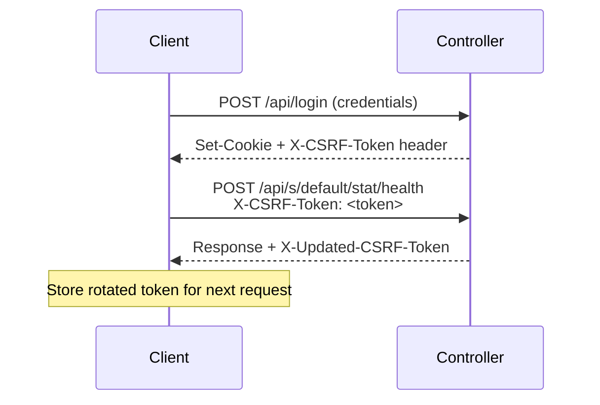

# API Surface

Unifly communicates with UniFi controllers through two distinct API interfaces, each with different authentication mechanisms and capabilities.

## Integration API

The official REST API introduced in UniFi Network 7.x+.

| Aspect       | Details                                                                                         |
| ------------ | ----------------------------------------------------------------------------------------------- |
| **Auth**     | API key via `X-API-KEY` header                                                                  |
| **Base URL** | `https://<controller>/proxy/network/integration/v1/` (UniFi OS) or `/integration/v1/` (Classic) |
| **Format**   | JSON with typed responses                                                                       |
| **Methods**  | Full CRUD plus action endpoints (GET, POST, PUT, PATCH, DELETE)                                 |

### Covered Resources

Devices, clients, networks, WiFi (WLANs), firewall policies, firewall zones, ACL rules, DNS records, traffic matching lists, hotspot vouchers, VPN servers, VPN tunnels, RADIUS profiles, WAN interfaces, sites, system info, device actions, port actions, device statistics, countries, and DPI categories/applications.

### Limitations

- No event streaming
- No historical statistics
- No alarm management

Legacy still owns the live and historical monitoring surfaces: event streaming, stats/reporting, and admin workflows.

## Legacy API

The original UniFi controller API, session-based with cookie authentication.

| Aspect       | Details                                                                 |
| ------------ | ----------------------------------------------------------------------- |
| **Auth**     | Cookie session + CSRF token                                             |
| **Base URL** | `https://<controller>/proxy/network/` (UniFi OS) or root path (Classic) |
| **Format**   | JSON envelope: `{ "meta": {...}, "data": [...] }`                       |
| **CSRF**     | Required on all POST/PUT/DELETE via `X-CSRF-Token` header               |

### Exclusive Features

- `events/latest`: Recent events
- WebSocket event streaming
- `stat/device`: Device statistics with traffic data
- `stat/health`: System health with ISP info, DNS, gateway details
- `stat/report/`: Historical bandwidth and client reports
- `cmd/sitemgr`: Device commands (adopt, restart, upgrade)
- `stat/admin`: Administrator management

### v2 Endpoints

Network Application 9+ exposes a second generation of legacy-authenticated endpoints under `/v2/api/site/{site}/`. These return plain JSON (no `{ meta, data }` envelope).

| Endpoint                         | Description                                   |
| -------------------------------- | --------------------------------------------- |
| `traffic-flow-latest-statistics` | DPI traffic flow data by application/category |
| `nat`                            | NAT rule CRUD (DNAT, SNAT, masquerade)        |

Unifly's DPI cascade tries the v2 endpoint first, then falls back to `stat/sitedpi` and `stat/dpi` for older firmware. NAT rules use the v2 endpoint exclusively:the Integration API does not expose NAT on Network Application 10.1.89.

### CSRF Token Flow

::: warning
GET requests work without CSRF tokens, but all POST/PUT/DELETE requests through `/proxy/network/` will fail with 403 without one.
:::

## Hybrid Mode

When configured with both an API key and credentials, unifly uses each API for what it does best:

| Operation                               | API Used                      |
| --------------------------------------- | ----------------------------- |
| List/get/create/update/delete resources | Integration API (NAT uses v2) |
| Stream events                           | Legacy API (WebSocket)        |
| Query statistics                        | Legacy API                    |
| Device commands                         | Legacy API                    |
| System health (ISP, DNS, gateway)       | Legacy API                    |

This provides the most complete feature set while using the cleanest API surface available for each operation.

## Error Handling

UniFi controllers return errors in different formats depending on the API:

- **Integration API**: Standard HTTP status codes with JSON error body
- **Legacy API**: Sometimes HTTP 200 with an error wrapper: `{"error":{"code":N,"message":"..."}}`

Unifly normalizes both into a unified `Error` type with 14 variants covering authentication failures, not-found, validation errors, rate limiting, and transport issues.
