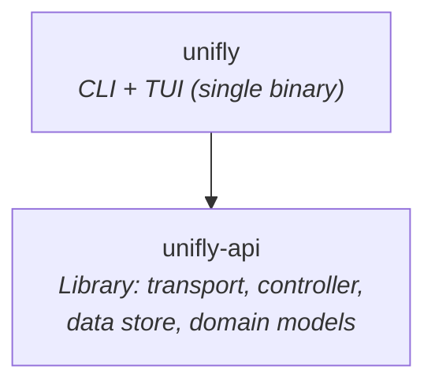

# 🏗️ Architecture

Unifly is a two-crate Rust workspace with a clean dependency chain.

## Crate Map

## Design Principles

### Thin Binaries, Fat Library

The `unifly` crate produces a single binary with CLI commands and a `unifly tui` subcommand, gated by feature flags. Both paths are thin shells over `unifly-api`, which provides the Controller lifecycle, DataStore, entity models, and API transport. Config and profile management lives in the `unifly` crate alongside the binary.

### Reactive Data Store

The `DataStore` uses `DashMap` for lock-free concurrent reads and `tokio::watch` channels for reactive updates. The TUI subscribes to entity streams and re-renders when data changes. No polling needed within the app.

### Dual API Transparency

`unifly-api`'s `Controller` transparently routes requests to the correct API backend. Callers don't need to know whether a feature uses the Integration API or the Session API. The controller handles routing, authentication, and response normalization.

## Key Types

| Type              | Purpose                                                                              |
| ----------------- | ------------------------------------------------------------------------------------ |
| `Controller`      | Main entry point. Wraps `Arc<ControllerInner>` for cheap cloning across async tasks  |
| `DataStore`       | Entity storage. `DashMap` + `watch` channels for lock-free reactive updates          |
| `EntityStream<T>` | Reactive subscription. Wraps `watch::Receiver` with `current()`/`changed()` API      |
| `EntityId`        | Dual-identity. `Uuid(Uuid)` or `Legacy(String)` for entities that exist in both APIs |
| `AuthCredentials` | Auth mode. `ApiKey`, `Credentials`, `Hybrid`, or `Cloud` variants                    |

## Next Steps

- [Crate Structure](/architecture/crates): what each crate does
- [Data Flow](/architecture/data-flow): how data moves through the system
- [API Surface](/architecture/api-surface): Integration API vs Session API
