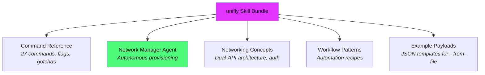

# 🪄 AI Agent Skill

Unifly ships with a dedicated skill bundle that teaches AI coding agents how to manage your UniFi network infrastructure. Your agent gets the full CLI reference, automation workflows, and a ready-made network manager agent.

## Install

```bash
# Claude Code, Cursor, Copilot, Codex, Gemini, and more
npx skills add hyperb1iss/unifly

# Target a specific agent platform
npx skills add hyperb1iss/unifly -a claude-code

# As a Claude Code plugin
/plugin marketplace add hyperb1iss/unifly
```

## What's Included



| Component                 | Description                                                                                |
| ------------------------- | ------------------------------------------------------------------------------------------ |
| **unifly skill**          | Complete CLI reference with command syntax, flags, output formats, and automation tips     |
| **Network Manager agent** | Autonomous agent for provisioning VLANs, auditing firewalls, diagnosing connectivity       |
| **Reference docs**        | UniFi networking concepts, dual-API gate matrix, auth decision tree                        |
| **Workflow patterns**     | Runnable recipes for event streaming, firewall reordering, DHCP reservations, DNS policies |
| **Example payloads**      | JSON templates for `--from-file` (networks, firewall, NAT, WiFi)                           |

## What Your Agent Can Do

With the skill installed, your coding agent can:

- **Provision infrastructure**: Create VLANs, WiFi SSIDs, firewall zones, and isolation policies in the correct dependency order
- **Audit security**: Check for open WiFi, permissive firewall rules, missing zone isolation
- **Diagnose connectivity**: Trace device topology, check client signal strength, review event logs
- **Manage devices**: Restart APs, adopt new devices, check firmware versions
- **Query statistics**: Pull bandwidth trends, DPI app breakdown, client count history
- **Automate workflows**: Bulk DHCP reservations, DNS policy management, voucher provisioning

## Slash Commands

Two slash commands are included for quick actions:

| Command          | Description                                                 |
| ---------------- | ----------------------------------------------------------- |
| `/unifly-status` | Quick health check of your UniFi infrastructure             |
| `/unifly-audit`  | Security audit of WiFi, firewall, and network configuration |

## Prerequisite

The agent needs unifly installed and configured on the system where it runs:

```bash
# Install unifly
curl -fsSL https://raw.githubusercontent.com/hyperb1iss/unifly/main/install.sh | sh

# Configure a controller profile
unifly config init
```

The skill teaches the agent to use `unifly` CLI commands. It does not connect to your controller directly.

## Example Prompts

Once the skill is installed, try these with your coding agent:

- _"Set up an IoT VLAN on 10.0.30.0/24 with a dedicated WiFi SSID and firewall isolation from the trusted network"_
- _"Audit my firewall rules for any allow-all policies or missing zone isolation"_
- _"Find the client named 'ring-doorbell' and show me its connection details"_
- _"Show me the network topology and identify any devices that are offline"_
- _"Stream events for the next few minutes and flag anything unusual"_

The agent will use `unifly` commands with `-o json` output, parse the results, and orchestrate multi-step workflows automatically.

## 🎯 Next Steps

- [Quick Start](/guide/quick-start): make sure unifly is configured before using the skill
- [Authentication](/guide/authentication): API Key mode is the recommended default on UniFi OS. Hybrid is only needed for WebSocket features like `events watch`
- [CLI Commands](/reference/cli): the commands the agent will use under the hood
