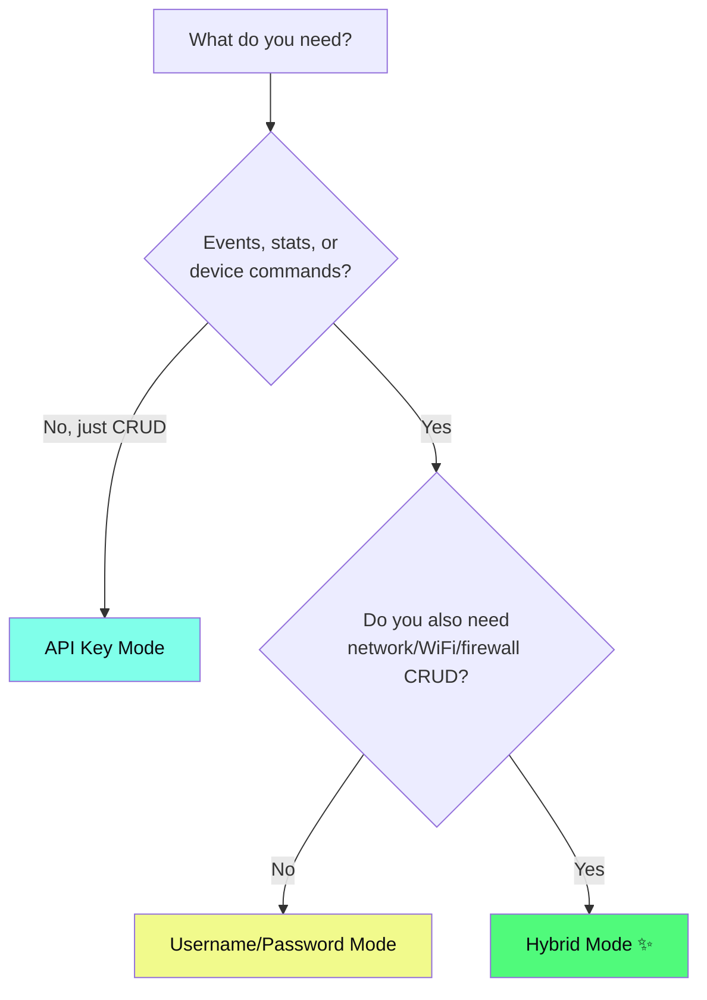
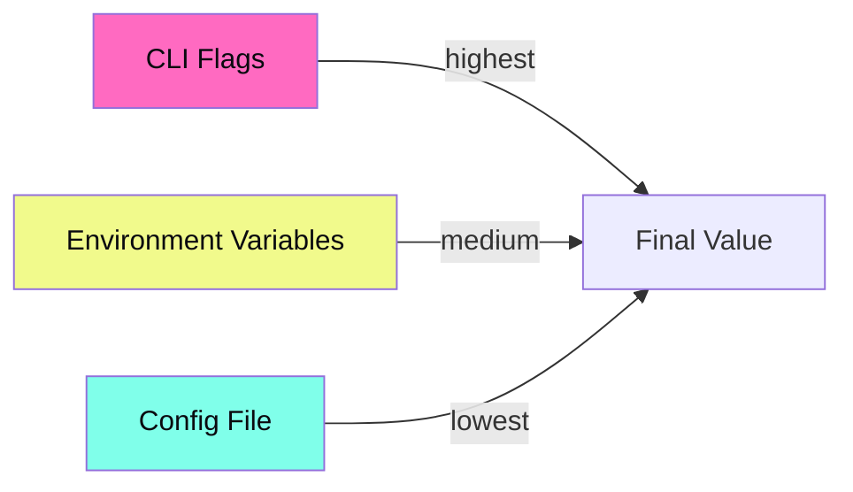

# Authentication

Unifly supports three authentication modes. The right choice depends on what you need to do.

## Which Mode Do I Need?



::: tip Recommended
**Hybrid mode** gives you full access to everything. Use it unless you have a specific reason not to.
:::

## API Key

Generate a key on your controller under **Settings > Integrations**. Provides full CRUD access via the Integration API.

```bash
unifly config init                     # Select "API Key" during setup
unifly --api-key <KEY> devices list    # Or pass directly
```

| Pros | Limitations |
|---|---|
| Simplest setup | No event streaming |
| No session management | No historical statistics |
| Stable, no token expiry | No device commands (restart, adopt, locate) |
| Works for all config CRUD | Client/device records miss some fields |

Best for: CI/CD pipelines, scripted provisioning, config-only workflows.

## Username / Password

Legacy session-based auth with cookie and CSRF token handling.

```bash
unifly config init                     # Select "Username/Password" during setup
```

| Pros | Limitations |
|---|---|
| Full Legacy API access | Sessions expire periodically |
| Events, stats, device commands | No access to modern Integration endpoints |
| Admin management | DNS, ACL, traffic lists unavailable |

Best for: Monitoring-focused setups, event streaming, read-heavy workflows.

## Hybrid Mode

Both APIs at once. API key for Integration CRUD, username/password for Legacy features. The setup wizard offers this when you provide both.

```bash
unifly config init                     # Select "Hybrid" during setup
```

| Capability | API Used |
|---|---|
| Networks, WiFi, Firewall, DNS, ACL, Traffic Lists | Integration API |
| NAT policies | Legacy v2 API (requires credentials) |
| Events, Stats, DPI | Legacy API |
| Device commands (restart, adopt) | Legacy API |
| Client/device field enrichment | Both (merged by IP/MAC) |

How it works: unifly routes each request to the best API automatically. Client and device records are enriched by merging Integration data with Legacy fields (traffic bytes, hostname, wireless info, uplink MAC, VLAN).

To verify Hybrid is working, check that `clients list` shows traffic bytes and hostname columns populated.

## Credential Storage

All credentials are stored in your OS keyring:

| OS | Backend |
|---|---|
| macOS | Keychain |
| Linux | Secret Service (GNOME Keyring, KWallet) |
| Windows | Windows Credential Manager |

The `config.toml` file stores non-sensitive settings like controller URLs and site names. The setup wizard offers keyring storage by default, but also provides a plaintext config fallback for environments where the keyring isn't available (headless servers, WSL, CI).

To update a stored password:

```bash
unifly config set-password              # Updates the active profile
unifly config set-password --profile office  # Updates a specific profile
```

## Environment Variables

For CI/CD and scripting, pass credentials via environment:

```bash
export UNIFI_API_KEY="your-api-key-here"
export UNIFI_URL="https://192.168.1.1"
unifly devices list
```



CLI flags override environment variables, which override config file values.

## MFA / TOTP

If your controller requires two-factor authentication:

```bash
# One-shot with 1Password CLI
UNIFI_TOTP=$(op read "op://Personal/UniFi/one-time password") \
  unifly devices list

# Or set totp_env in your config.toml profile:
# [profiles.home]
# totp_env = "UNIFI_TOTP"
```

::: tip
The `totp_env` setting must be edited directly in `config.toml`. It is not yet supported by `unifly config set`.
:::

## Next Steps

- [Configuration](/guide/configuration): full profile reference, environment variables, and precedence rules
- [CLI Commands](/reference/cli): what you can do with each auth mode
- [Troubleshooting](/troubleshooting): common auth errors and fixes
