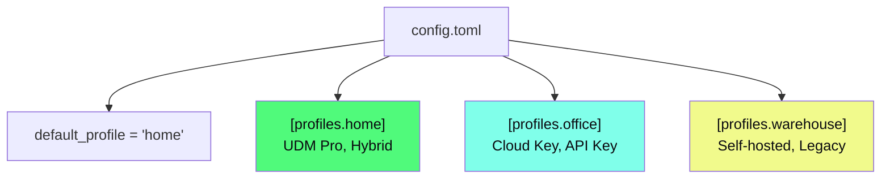

# Configuration

## Config File

Configuration lives in your platform-standard config directory:

| OS | Path |
|---|---|
| Linux | `~/.config/unifly/config.toml` |
| macOS | `~/Library/Application Support/unifly/config.toml` |
| Windows | `%APPDATA%\unifly\config.toml` |

The easiest way to create your config is the interactive wizard:

```bash
unifly config init
```

You can also edit the TOML file directly.

## Profile System

Profiles let you manage multiple controllers from a single config. Each profile stores a controller URL, site, auth mode, and associated settings.



### Managing Profiles

```bash
unifly config init             # Create or update a profile interactively
unifly config profiles         # List all profiles (* marks the active one)
unifly config use office       # Switch the default profile
unifly config show             # Show the current effective config
unifly -p home devices list    # Use a specific profile for one command
```

### Example: Multi-Controller Setup

```toml
default_profile = "home"

[defaults]
output = "table"
color = "auto"
timeout = 30

[profiles.home]
controller = "https://192.168.1.1"
site = "default"
auth_mode = "hybrid"
# Credentials stored in OS keyring via: unifly config set-password

[profiles.office]
controller = "https://10.0.0.1"
site = "default"
auth_mode = "integration"
api_key_env = "UNIFI_OFFICE_API_KEY"
insecure = true  # Self-signed cert on internal controller

[profiles.warehouse]
controller = "https://warehouse.example.com:8443"
site = "default"
auth_mode = "legacy"
username = "readonly-admin"
ca_cert = "/etc/ssl/certs/warehouse-ca.pem"
timeout = 45
```

### Profile Settings Reference

| Setting | Values | Description |
|---|---|---|
| `controller` | URL | Controller address (include port if non-standard) |
| `site` | string | Site name or UUID. Default: `default` |
| `auth_mode` | `integration`, `legacy`, `hybrid` | Which APIs to authenticate against |
| `username` | string | Legacy/Hybrid login username |
| `api_key` | string | Integration API key (prefer `api_key_env`) |
| `api_key_env` | string | Env var name containing the API key |
| `totp_env` | string | Env var name for MFA one-time password |
| `insecure` | bool | Accept self-signed TLS certificates |
| `ca_cert` | path | Custom CA certificate PEM file |
| `timeout` | seconds | Request timeout (default: 30) |

::: tip
Use `api_key_env` instead of `api_key` to avoid putting secrets in the config file. The API key is read from the named environment variable at runtime.
:::

### Setting Values via CLI

`unifly config set <key> <value>` supports these keys:

`controller`, `site`, `auth_mode`, `api_key`, `api_key_env`, `username`, `insecure`, `timeout`, `ca_cert`

```bash
unifly config set auth_mode hybrid
unifly config set insecure true
unifly config set timeout 60
```

::: tip
`totp_env` and `password` must be set directly in `config.toml` or via the setup wizard. They are not yet supported by `config set`.
:::

## Environment Variables

All settings can be overridden via environment variables. Useful for CI/CD, scripting, and ephemeral environments.

| Variable | Description |
|---|---|
| `UNIFI_API_KEY` | Integration API key |
| `UNIFI_URL` | Controller URL |
| `UNIFI_USERNAME` | Legacy API username |
| `UNIFI_PASSWORD` | Legacy API password |
| `UNIFI_PROFILE` | Active profile name |
| `UNIFI_SITE` | Target site name or UUID |
| `UNIFI_OUTPUT` | Default output format |
| `UNIFI_INSECURE` | `1` to accept self-signed certs |
| `UNIFI_TIMEOUT` | Request timeout in seconds |
| `UNIFI_TOTP` | One-time password for MFA controllers |
| `NO_COLOR` | Disable colored output (standard) |

### Example: CI/CD Pipeline

```bash
# GitHub Actions, GitLab CI, etc.
export UNIFI_URL="https://controller.internal"
export UNIFI_API_KEY="${UNIFI_API_KEY_SECRET}"
export UNIFI_INSECURE=1

unifly devices list --all -o json | jq '.[] | select(.state != "ONLINE")'
```

## Precedence

Settings are resolved in this order (highest priority first):


1. **CLI flags** (`--controller`, `--site`, `-o json`, etc.)
2. **Environment variables** (`UNIFI_URL`, `UNIFI_API_KEY`, etc.)
3. **Profile config** (`[profiles.home]` section in config.toml)
4. **Default values** (`[defaults]` section, then built-in defaults)

## Global Flags

These flags work with every command:

```
-p, --profile <NAME>     Controller profile to use
-c, --controller <URL>   Controller URL (overrides profile)
-s, --site <SITE>        Site name or UUID
-o, --output <FORMAT>    Output: table, json, json-compact, yaml, plain
-k, --insecure           Accept self-signed TLS certificates
-v, --verbose            Increase verbosity (-v, -vv, -vvv)
-q, --quiet              Suppress non-error output
-y, --yes                Skip confirmation prompts
    --timeout <SECS>     Request timeout (default: 30)
    --color <MODE>       Color: auto, always, never
    --no-cache           Force fresh login (bypass session cache)
```

## TLS Certificates

UniFi controllers use self-signed certificates by default. Three ways to handle this:

```bash
# 1. Per-command flag
unifly -k devices list

# 2. In your profile config
# insecure = true

# 3. Via environment
export UNIFI_INSECURE=1

# 4. Custom CA certificate (most secure)
# ca_cert = "/path/to/your-ca.pem"
```

::: warning
Only use `--insecure` with controllers you trust. It disables TLS certificate verification entirely. For production, prefer a custom CA certificate.
:::

## Session Cache

Unifly caches Legacy API sessions across commands for speed. If you rotate a password or encounter stale sessions:

```bash
unifly --no-cache devices list    # Force a fresh login
```

## Next Steps

- [Authentication](/guide/authentication): understand API key vs password vs hybrid
- [CLI Commands](/reference/cli): full command reference
- [TUI Dashboard](/reference/tui): screen-by-screen guide
- [Troubleshooting](/troubleshooting): common config and auth issues
