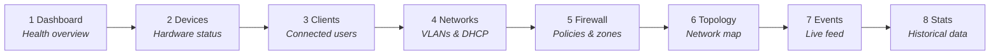

# 🔮 Quick Start

## Prerequisites

- A UniFi Network controller (Dream Machine, Cloud Key, UCG, or self-hosted)
- An API key (Settings > Integrations) and/or admin credentials
- unifly [installed](/guide/installation)

## Interactive Setup

Run the setup wizard to configure your first controller profile:

```bash
unifly config init
```

The wizard walks you through:

1. **Controller URL**: your controller's address (e.g., `https://192.168.1.1`)
2. **Authentication**: API key, username/password, or hybrid mode
3. **Site selection**: choose which site to manage

Credentials are stored in your OS keyring by default. A plaintext config fallback is available if the keyring isn't accessible.

## First Commands

Once configured, explore your network:

```bash
# List all adopted devices
unifly devices list

# See connected clients
unifly clients list

# View networks and VLANs
unifly networks list

# Stream live events
unifly events watch
```

Example output:

```
 ID                                   | Name            | Model           | Status
--------------------------------------+-----------------+-----------------+--------
 a1b2c3d4-e5f6-7890-abcd-ef1234567890 | Office Gateway  | UDM-Pro         | ONLINE
 b2c3d4e5-f6a7-8901-bcde-f12345678901 | Living Room AP  | U6-LR           | ONLINE
 c3d4e5f6-a7b8-9012-cdef-123456789012 | Garage Switch   | USW-Lite-8-PoE  | ONLINE
```

## Output Formats

Every command supports multiple output formats:

```bash
unifly devices list                  # Default table (human-readable)
unifly devices list -o json          # Full JSON (for scripting)
unifly devices list -o json-compact  # Single-line JSON (pipe-friendly)
unifly devices list -o yaml          # YAML
unifly devices list -o plain         # IDs only, one per line (for xargs)
```

::: tip
Use `-o json` for automation and `-o plain | xargs` for batch operations:

```bash
unifly clients list -o plain | xargs -n1 unifly clients get
```

:::

## Launch the TUI

For real-time monitoring, launch the terminal dashboard:

```bash
unifly tui                   # Default profile
unifly tui -p office         # Specific profile
```



Navigate screens with number keys `1`-`8`. Press `,` for settings, `?` for help, `q` to quit.

::: tip Heads Up

- `events watch` requires Session or Hybrid auth (WebSocket needs a cookie session)
- List commands default to 25 rows. Pass `--all` or `--limit 200` for full results
- Use Hybrid only when you need live event streaming (`events watch`). API Key mode covers most commands on UniFi OS
  :::

## Multiple Controllers

Add more profiles for different controllers:

```bash
unifly config init                    # Add another profile
unifly config profiles                # List all profiles
unifly config use office              # Switch default profile
unifly -p home devices list           # One-off override
```

## 🎯 Next Steps

- [Configuration](/guide/configuration): all config options, environment variables, and profiles
- [Authentication](/guide/authentication): API key vs password vs hybrid
- [CLI Commands](/reference/cli): full command reference
- [TUI Dashboard](/reference/tui): screen-by-screen guide with all keybindings
- [AI Agent Skill](/guide/agents): let your coding agent manage your network
