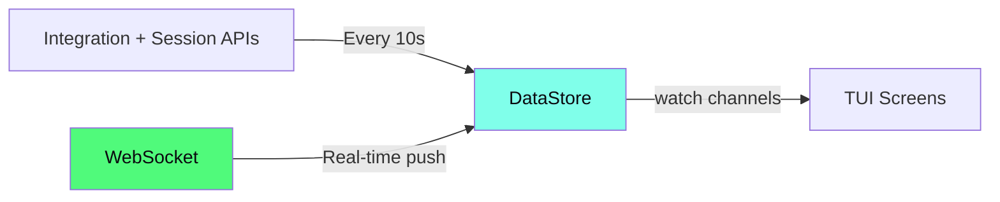

# 🖥️ TUI Dashboard

The `unifly tui` subcommand launches a real-time terminal dashboard for monitoring your UniFi network. Ten screens cover everything from live bandwidth charts to firewall policy management.

## Launch

```bash
unifly tui                   # Launch with default profile
unifly tui -p office         # Use a specific profile
unifly tui -k                # Accept self-signed TLS certs
unifly tui -v                # Verbose logging to temp directory
```

## Screens

Navigate with number keys `1`-`8`, `Tab`/`Shift+Tab`, or `,` for Settings:

| Key | Screen         | When to Use                                                    |
| --- | -------------- | -------------------------------------------------------------- |
| `1` | **Dashboard**  | At-a-glance health check. Start here.                          |
| `2` | **Devices**    | Investigating a specific device, checking firmware, restarting |
| `3` | **Clients**    | Finding a client, checking signal strength, blocking a device  |
| `4` | **Networks**   | Reviewing VLANs, editing DHCP settings, checking subnets       |
| `5` | **Firewall**   | Auditing policies, reordering rules, checking zone assignments |
| `6` | **Topology**   | Understanding physical network layout, tracing uplink paths    |
| `7` | **Events**     | Real-time troubleshooting, watching for connectivity issues    |
| `8` | **Stats**      | Historical analysis, bandwidth trends, DPI app breakdown       |
| `,` | **Settings**   | Switching profiles, changing themes, adjusting display options |
|     | **Onboarding** | First-run setup wizard (shown automatically on first launch)   |

## Dashboard Panels

The dashboard packs eight live panels into a dense, information-rich overview:

| Panel             | What It Shows                                                              |
| ----------------- | -------------------------------------------------------------------------- |
| **WAN Traffic**   | Area-fill chart with Braille line overlay, live TX/RX rates, peak tracking |
| **Gateway**       | Model, firmware, WAN IP, IPv6, DNS, ISP name, latency, uptime              |
| **Connectivity**  | Subsystem status dots (WAN/WWW/WLAN/LAN/VPN), aggregate traffic bars       |
| **Capacity**      | Color-coded CPU/MEM gauges, load averages, device/client fleet count       |
| **Networks**      | VLANs sorted by ID with IPv6 prefix delegation and SLAAC mode              |
| **WiFi / APs**    | Client count and WiFi experience percentage per access point               |
| **Top Clients**   | Proportional traffic bars with fractional block characters                 |
| **Recent Events** | Compact event display, color-coded by severity                             |

## Key Bindings

### Global

| Key                       | Action                 |
| ------------------------- | ---------------------- |
| `1`-`8`, `,`              | Jump to screen         |
| `Tab` / `Shift+Tab`       | Next / previous screen |
| `j` / `k` / `Up` / `Down` | Navigate up / down     |
| `g` / `G`                 | Jump to top / bottom   |
| `Ctrl+d` / `Ctrl+u`       | Page down / up         |
| `Enter`                   | Select / expand detail |
| `Esc`                     | Close detail / go back |
| `/`                       | Search                 |
| `?`                       | Help overlay           |
| `q`                       | Quit                   |

### Screen-Specific

| Screen               | Key             | Action                                              |
| -------------------- | --------------- | --------------------------------------------------- |
| **Devices**          | `R`             | Restart selected device                             |
| **Devices**          | `L`             | Locate (flash LED)                                  |
| **Devices** (detail) | `h` / `l`       | Previous / next detail tab                          |
| **Clients**          | `Tab`           | Cycle filter (All / Wireless / Wired / VPN / Guest) |
| **Clients**          | `b` / `B`       | Block / unblock client                              |
| **Clients**          | `x`             | Kick client                                         |
| **Networks**         | `e`             | Edit selected network (opens overlay)               |
| **Firewall**         | `h` / `l`       | Cycle sub-tabs (Policies / Zones / ACL / NAT)       |
| **Firewall**         | `K` / `J`       | Reorder policy up / down                            |
| **Topology**         | Arrows          | Pan canvas                                          |
| **Topology**         | `+` / `-`       | Zoom in / out                                       |
| **Topology**         | `f`             | Fit to view                                         |
| **Events**           | `Space`         | Pause / resume live stream                          |
| **Stats**            | `h` `d` `w` `m` | Period: 1h / 24h / 7d / 30d                         |
| **Stats**            | `r`             | Refresh data                                        |

## Detail Views

Press `Enter` on any list item to open a detail panel with comprehensive information:

- **Devices**: 5-tab panel (Overview, Performance, Radios, Clients, Ports)
- **Clients**: Connection details, traffic history, DHCP info
- **Networks**: Full VLAN config with DHCP ranges and IPv6 settings
- **Firewall**: Policy details with traffic filter breakdown

Navigate detail tabs with `h`/`l`. Press `Esc` to close.

## Data Refresh



- **Devices and clients**: polled every 10 seconds from both APIs
- **Health and system info**: polled every 10 seconds
- **Events**: pushed via WebSocket in real-time (no polling delay)
- **Bandwidth**: sampled from device stats on each refresh cycle

## Authentication Modes

The TUI works with all authentication modes, but some screens degrade gracefully:

| Mode              | Dashboard | Devices  | Clients  | Events   | Stats    |
| ----------------- | --------- | -------- | -------- | -------- | -------- |
| API Key           | Partial   | Full     | Full     | No       | No       |
| Username/Password | Full      | Full     | Full     | Full     | Full     |
| **Hybrid**        | **Full**  | **Full** | **Full** | **Full** | **Full** |

::: tip
**API Key mode** works for most TUI screens on UniFi OS. Use **Hybrid mode** only when you need live WebSocket event streaming (the Events screen). Statistics and device data are available via Session HTTP endpoints that API Key mode can reach.
:::

## Graceful Degradation

When data is unavailable (e.g., API-key-only mode without Session access), panels show placeholder lines instead of crashing. The dashboard adapts to whatever data sources are available. Missing data is indicated with dim placeholder text.

## Theme

The TUI uses the [Opaline](https://crates.io/crates/opaline) theme engine with the SilkCircuit color palette. Press `,` to open Settings and use the theme selector to preview and switch themes. Theme changes take effect immediately and persist to `defaults.theme` in your config file. You can also set the initial theme via the `UNIFLY_THEME` environment variable at launch.

::: warning Known Limitation
Controller reconnect after a network interruption is currently broken. If the connection drops, restart the TUI to reconnect.
:::

## 🎯 Next Steps

- [CLI Commands](/reference/cli): the full command reference
- [Authentication](/guide/authentication): understand what each auth mode enables in the TUI
- [Troubleshooting](/troubleshooting): TUI logs, display issues, and common fixes
